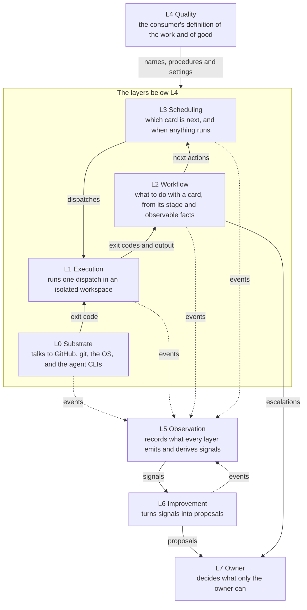

ABOUTME: Rigger's architecture of record: the eight layers and their boundaries, every extension
point a consumer has, the failure model, and the CI-enforced budgets.

# Architecture

Read this before changing anything. It fixes boundaries, contracts and budgets, and the few
internals a boundary depends on. It is not a design document for any one module.

`docs/spec/requirements.md` says what must be true of Rigger. This document is the structure that
satisfies it, and it is one structure among the several that could. Where the two disagree, the
requirement is right and this document is wrong. What must be true is therefore stated there and
never repeated here; what follows is how it is met.

Rigger is eight layers. Each has one job, one vocabulary at its upper boundary, and one change
authority. A fault is handled at the lowest layer that can handle it and crosses a boundary only
translated into that boundary's vocabulary. That rule is the reason the layers exist: in the
system Rigger replaces, a stray compiler helper process crossed four boundaries unchanged and
ended as a decision on the owner's desk.

## Bird's eye

A board holds cards. Scheduling (L3) decides which card is next and when anything runs. Workflow
(L2) decides what to do with that card from its stage and observable facts. Execution (L1) runs
the dispatch in an isolated workspace and returns an exit code. Substrate (L0) talks to GitHub,
git, the OS, and the agent CLIs. Quality (L4) is the consumer's definition of the work and of
good, and every layer but L7 reads some part of it without it being part of Rigger. Observation (L5) records what
every layer emits and derives signals. Improvement (L6) turns signals into proposals. The owner
(L7) decides what only the owner can.

## The layers

| Layer | Decides | Never decides | Emits, in part | Changed by | Lives in |
|---|---|---|---|---|---|
| **L0 Substrate** | How to talk to one external system: the forge (board, issues, PRs, CI through `gh`), git, the OS process model, each agent CLI. Retries, timeouts, containment mechanics. | Anything about cards or work. L0 does not know what a card is. | Call latency and failure, process spawn and exit, survivors killed by name and command line | Engineer cards, within the L0 budget | `src/substrate/` |
| **L1 Execution** | How to run one dispatch in one workspace: isolation, lifetime, result as exit code plus captured output | Whether to run it, or what the result means | Dispatch start, end, duration, exit, timeout | Engineer cards, within the L1 budget | `src/execution/` |
| **L2 Workflow** | The next action for a card from its stage and observable facts; the review loop; the gate rule; escalation routing; whether a failure is the work's or the environment's | Which card is next; what good means | Card transitions with cause, verdicts, loop rounds, escalations by category | Spec rows, ratified by the owner | `src/workflow/` |
| **L3 Scheduling** | Pull order by priority, concurrency, claims taken synchronously before any await, the repo lane, admission and the hold that closes it, and the three trigger kinds | What a card requires or whether it passed | Triggers by kind and target, queue depth, in-flight count, wait, lock contention, throughput, admission holds and their reason | Spec rows and config | `src/scheduling/` |
| **L4 Quality** | What the work is and what good means: kinds of work and their maker and judge sets, roles, review procedure, provisioning steps, recorded decisions, which improvement roles run and which signals count | How Rigger runs, beyond the engine settings the extension points name | Nothing. L2 records what a role produced: findings by code and judge, rounds per kind of work, rework, tier corrections, later defect escape | The owner, in the consumer's repository | The consumer's repository; Rigger ships templates under `templates/` |
| **L5 Observation** | How every layer's events are recorded and which signals derive from them | Anything that acts on them. L5 records and derives, never decides | The report | Engineer cards | `src/observation/` |
| **L6 Improvement** | What to propose, and to whom, from L5's signals. The object-level loop reorders L3's queue and re-tiers within L4. The meta-level loop proposes changes to any layer. | It changes no code, in any layer, ever | Proposals with target layer, and their outcome | Spec rows | `src/improvement/` |
| **L7 Owner** | Recorded decisions, config, the last verdict when named as a judge, answers to escalations | | | | A person |

## Boundary rules

1. **Faults stop at the lowest layer that can handle them.** A lingering process after a build is
   L0's: kill it, log its name, return the exit code. L1 sees a clean result. L2 never learns the
   process existed. A card reaches the owner only through L2's escalation categories, never
   through a substrate event.
2. **Each boundary has one vocabulary.** L1 gives L2 exit codes and output. L2 gives L3 next
   actions. L3 gives L1 dispatches. L4 gives the layers below it names, procedures and settings. If a layer needs to
   know something from two layers down, the design is wrong; fix the boundary, do not reach
   through it.
3. **The meta loop may target the core, on conditions.** A proposal against L0 through L3 must
   cite the signal from that layer's own telemetry it would improve, must pass the budget check,
   and goes to the owner. A proposal against L4 goes to the owner. L6 changes no code itself, in
   any layer, and its proposals are themselves telemetry, so the report shows whether they
   helped.

## The layer map

The eight layers as one diagram: which layer hands what to which. The edges carry the
vocabularies boundary rule 2 names, the exit code rule 1 names, and the events, signals,
proposals and escalations the layer table states. Every layer but L7 reads some part of L4, and
the edge drawn is the one boundary rule 2 names.



## Scenario binding

A scenario is defined entirely in L4. Rigger's loops are scenario-neutral machinery that L4
parameterizes. L2 runs the maker and judge loop; L4 names the maker and the judges for each kind
of work. L6 runs the improvement loop at its cadence with the report as input; L4 names which
roles run in it and which signals count. A consumer that switches L6 off still has a complete
scenario. Software development binds an engineer and a code reviewer, and a Re-planner reading
review rounds and rework. Content operations would bind a writer and an editor, and an editorial
planner reading editor rounds and time to publish. Nothing in L0 through L3, L5, or L6 changes
between the two.

## Extension points

Everything a consumer can change is declared in L4 and read by whatever the row names beside it —
a layer, or something Rigger ships that no layer reads. There are no other hooks. A need that does not fit one of these rows is a design conversation, not a
workaround.

| Extension point | Declared by the consumer as | Read by | v0 |
|---|---|---|---|
| **Engine settings** | The repository, the board and its column display names, the concurrency N, the worktree root, the state directory (`.rigger/` by default), the rule that derives a worktree's topic from a card, and whether telemetry pushes | L0 for the repository and board; L1 for the worktree root and topic rule; L3 for N; L5 for the push | Yes, N defaults to 3 |
| **Kinds of work** | A name per kind, with its maker role, ordered judge roles (`owner` last if at all), provisioning steps, the review loop bound in rounds, and the card labels that select the kind | L2 for the loop and gate; L3 for provisioning | Yes |
| **Roles** | A name, an agent file in the consumer's repository, a provider, a default model tier, and the card labels that override that tier | L1 for dispatch; L2 for maker and judge identity | Yes |
| **Where provider assets live** | Nothing. A role names its agent file by path, so the directory is whatever the provider reads: Claude Code reads `.claude/`, and a second adapter reads its own. `init` forks each template where its provider looks for it | L0, through the provider adapter | Fixed by the provider |
| **Role skills** | Skills in the consumer's repository, invoked by a role's agent file: the review procedure a judge runs, and how an author writes a card's acceptance | Nothing in Rigger reads them; the role does | Yes |
| **Verdict vocabulary** | Fixed by Rigger. A judge returns sound, needs revision, or critical | L2 | Fixed |
| **Escalation categories** | Fixed by Rigger: recorded-decision change, critical, ambiguous. A maker or the loop raises one; a judge does not | L2 | Fixed |
| **Document checking** | Which documents the resolver checks and at what fail level, which sources it reads anchors from, and what each check exempts | The resolver, which ships as a template and runs in the consumer's own checks. No layer reads it | Yes |
| **Provisioning steps** | A command, optionally a working directory, whether the work requires it, and the labels that select it. A kind's list and a step's own labels both apply, and a step runs when both admit it | L3 schedules; L1 runs | Yes |
| **Escalation set** | Which of the fixed categories are the owner's to decide. A consumer chooses among them and adds none | L2 | Yes, default is all three |
| **Improvement roles** | Per loop: the role, its cadence (drain or clock), and the signals it reads | L6 | After v0 |
| **Clock triggers** | A schedule, a card template or an internal job, and a catch-up policy | L3 | Yes |
| **Provider adapters** | A module implementing the adapter interface for one agent CLI | L0 | Claude Code shipped; Codex next |
| **Forge adapter** | A module implementing the board, issue, PR, and CI interface | L0 | GitHub only; the interface exists so a second forge is an L0 change and nothing else |
| **Deliverable** | Fixed in v0: a pull request merged behind the gate. Content scenarios still deliver by branch and PR. A publish adapter for non-git targets is a later L0 extension | L2 | Fixed |

The config file declares the rows whose v0 column says Yes. The rows marked fixed are Rigger's, and
Role skills and Document checking are files the config points at rather than contains. The two
adapters are code, added to Rigger itself. The shape, abbreviated:

```js
// Rigger's own config: it is its own first consumer.
export default {
  repo: 'williacj/rigger',
  board: { project: 1, columns: { ready: 'Ready', coding: 'Coding', review: 'Review', owner: 'Owner', done: 'Done' } },
  concurrency: 3,
  roles: {
    engineer:      { agent: '.claude/agents/engineer.md',       provider: 'claude', tier: 'standard' },
    reviewer:      { agent: '.claude/agents/reviewer.md',       provider: 'claude', tier: 'high' },
    pm:            { agent: '.claude/agents/pm.md',             provider: 'claude', tier: 'high' },
    architect:     { agent: '.claude/agents/architect.md',      provider: 'claude', tier: 'high' },
    spikeEngineer: { agent: '.claude/agents/spike-engineer.md', provider: 'claude', tier: 'high' },
  },
  kinds: {
    // One judge. rounds omitted, so the default of three applies.
    change:    { select: { labels: ['type:change'] },    maker: 'engineer',      judges: ['reviewer'],
                 provisioning: ['npm-ci'] },
    // The panel case: three agent judges concurrently, the owner last. The architect rules on a
    // proposed requirement here, which is the gate D18 rule 6 puts before the cards are cut.
    spec:      { select: { labels: ['type:spec'] },      maker: 'pm',            judges: ['reviewer', 'engineer', 'architect', 'owner'],
                 rounds: 2, provisioning: ['npm-ci'] },
    // The architect makes this document's own deltas (D18 rule 2).
    structure: { select: { labels: ['type:structure'] }, maker: 'architect',     judges: ['reviewer', 'owner'],
                 provisioning: ['npm-ci'] },
    // Decomposition: the PM cuts larger work into cards, and writes each card's acceptance
    // (D18 rule 5). A kind no role makes is never dispatched, so the decomposer needs this row.
    intake:    { select: { labels: ['type:intake'] },    maker: 'pm',            judges: ['reviewer', 'owner'],
                 provisioning: ['npm-ci'] },
    spike:     { select: { labels: ['type:spike'] },     maker: 'spikeEngineer', judges: ['reviewer'],
                 provisioning: ['npm-ci'] },
  },
  provisioning: {
    'npm-ci': { run: 'npm ci', required: true },
    // Only cards that touch the demo tape pay for this.
    'vhs':    { run: 'brew list vhs || brew install vhs', select: { labels: ['area:demo'] } },
  },
  escalate: ['recorded-decision', 'critical', 'ambiguous'],
  // improvement and clock arrive with M9 and M7. A consumer that switches them
  // off still has a complete scenario.
  telemetry: { push: false },
};
```

## Triggers

L3 owns three trigger kinds. **Pull** fires on board occupancy: a card in Ready and a free slot.
**Drain** fires on quiescence: nothing in flight. **Clock** fires on a schedule from config.

Scheduled work is visible work. A clock trigger declares whether its work is a card; when it is,
the trigger creates the card and L2 runs it like any other. A trigger declaring an internal job
dispatches directly, as do Rigger's own report and stale-card sweep, and nothing else dispatches
without a card. A clock trigger that fires while
Rigger is not running fires once on the next start if its window was missed; that catch-up policy
is per trigger in config.

Keeping the Rigger process alive across reboots is the OS scheduler's job. The launchd assets that
do it are L0. A Windows equivalent arrives with native Windows, which is not in v0.

## The gate

The gate is a git hook in the consumer's repository, under `.githooks/`, reached through
`core.hooksPath`. `rigger init` installs it. It runs on a ref update, so it binds every route to
the main line alike: a dispatch Rigger made, a person's own `git merge`, a second provider's
session. Nothing reaches the main line around it, which is what `R-GATE-1` asks for and what an
in-process check could not give.

It reads verdict markers and nothing else. A judge writes one marker per dispatch, naming the
work it ruled on, the acceptance revision it ruled against, its verdict, and each acceptance item
as met or unmet. The markers live in the consumer's repository beside the work, so a restart
needs no state of its own to find them, and the gate needs no engine to be running.

The gate holds no opinion. It compares markers against the card's configured judges and the
consumer's own checks, and refuses on anything missing, unreadable or stale. L2 owns the rule it
applies; the hook is where that rule is enforced, because a rule enforced inside the engine binds
only the engine.

## Failure model

Rigger owns every process it starts: each dispatch runs in one process group Rigger created, and
Rigger records that group id. On its own exit it kills every group it holds. On start, L1 kills
every group it recorded before anything else runs. L3 then reads the board, and L2 computes each
card's next action from its stage and observable facts. Those facts are the card's column, its
pull request, that request's head SHA, the SHA and acceptance revision each verdict names, and the
last transition the board shows. L2 derives them on every read, so no card state is kept.

`.rigger/` holds three things and no others: the process group ids L1 must read back to kill,
whether admission is open and why it closed, and L5's event stream. Two more things outlive a
restart outside it — a card's worktree, which holds work not yet committed, and the verdict
markers in the repository. Rigger writes no other state. Recovery machinery enters L1 only after a recorded production incident in which
redo was demonstrably insufficient.

The result of a command is its exit code and captured output. L2 classifies a failure as the
work's or as its environment's. An environment failure retries the card once; a second of the same
kind, with no success between, has L3 close admission. A process still alive
when the direct child exits is terminated by L0 and recorded by name and command line; it never
changes the result.

## Telemetry

L5 stamps every event with a timestamp, run id, layer, and the card and dispatch it arose under.
The emitting layer supplies neither, which is how an L0 event carries a card id that L0 never
knew. Each layer owns one event family and no layer writes another layer's events. L5 owns the sink,
one JSONL stream in the consumer's state directory, and the report. Six layers produce a signal
set. L5 owns the sink rather than a signal, and L7 is a person. A signal is derived, where an
event is recorded: L2 records a tier correction, and L4's tier accuracy is the rate across them.

- **L0** substrate fault rate
- **L1** execution duration and survivor rate
- **L2** escalation rate and rounds per card
- **L3** throughput and utilization
- **L4** first-pass rate, rework, and tier accuracy
- **L6** proposal acceptance

The envelope and sink exist from the first dispatch. Each layer's family lands with the layer.

The shape, abbreviated. One card's events, across four layers:

```jsonl
{"ts":"2026-09-13T14:02:11.310Z","run":"r-8f21","layer":"L3","event":"pull","card":1412,"kind":"change","queueDepth":7,"inFlight":2}
{"ts":"2026-09-13T14:14:45.882Z","run":"r-8f21","layer":"L1","event":"dispatch.end","card":1412,"dispatch":"d-01","role":"engineer","exit":0,"ms":734120}
{"ts":"2026-09-13T14:19:03.005Z","run":"r-8f21","layer":"L0","event":"survivor.killed","card":1412,"name":"rust-analyzer-proc-macro-srv","cmd":"…"}
{"ts":"2026-09-13T14:41:52.771Z","run":"r-8f21","layer":"L2","event":"verdict","card":1412,"dispatch":"d-02","role":"reviewer","sha":"9c1af03","verdict":"needs-revision","findings":2}
{"ts":"2026-09-13T15:02:40.117Z","run":"r-8f21","layer":"L2","event":"escalation","card":1412,"category":"recorded-decision","to":"owner"}
```

The envelope repeats unchanged across layers and the card id threads through all of them. The L0
survivor kill is recorded and goes no further: the escalation two lines later is L2's, raised for
its own reason. Field names are not yet fixed.

## Budgets

Each layer has a line budget, the CLI and config have one between them, and their sum is the
package budget. The core is L1 plus L0's process adapter, so it spans two rows, and it is where a bug means a
stray process or a lost result. The gate has a row of its own, carved from L2's, because L2 owns
the rule and the hook enforces it.
These bound Rigger's own production code — what runs while a card is being worked. L4 has no
production-line budget: the roles, review procedure, and provisioning steps are the consumer's, live in the
consumer's repository, and are theirs to size. L7 is a person.

Four things are not counted. Tests, the templates under `templates/`, and the checks Rigger ships
for a consumer's own CI are outside the budget, because none of them runs a card. Blank lines and
comment lines are outside it too: a comment cannot carry a bug.

| Budget | Production lines |
|---|---|
| L0 | 3,000 |
| L1 | 1,500 |
| L2 | 1,600 |
| The gate | 400 |
| L3 | 1,000 |
| L5 | 1,500 |
| L6 | 1,500 |
| CLI and config | 1,500 |
| **Package** | **12,000** |

CI runs one check, against the package total. A layer that grows past its own row is a review
finding rather than a build failure, and the rows are the agreed split rather than one gate each.

A change that would push the package over must delete as much as it adds, or carry a ratified
budget change.

Instruction files carry one budget of their own, covering the root `AGENTS.md` and every nested
one together, checked the same way: one number, one check. Moving text from the root file into a
directory's file therefore changes nothing; only deleting does. The budget is 2,500 words.

Rigger's live instruction pool covers its `.claude/` role prompts and skill instructions. Its
budget is 13,000 words, separate from the `AGENTS.md` budget. The check counts each live file
once. Distribution templates under `templates/claude/` do not spend this pool. Another consumer
sizes its own L4 roles and procedures.

## Where to start reading

Once code exists: `src/workflow/next-action` for what Rigger does with a card,
`src/execution/run` for how it runs anything, and `src/scheduling/tick` for when. A layer's
directory carries an `AGENTS.md` when it has rules that bind work there, and that file holds
nothing else; the layer's vocabulary, decisions and event family are the table above, which it
points at rather than restates.
